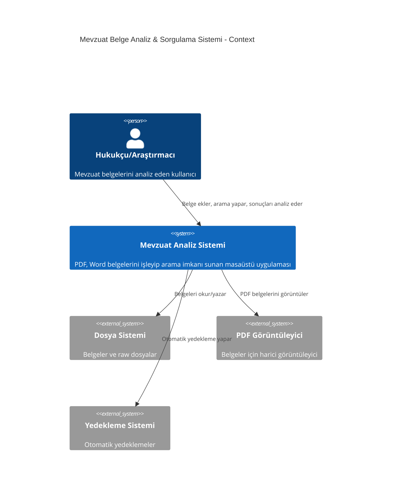
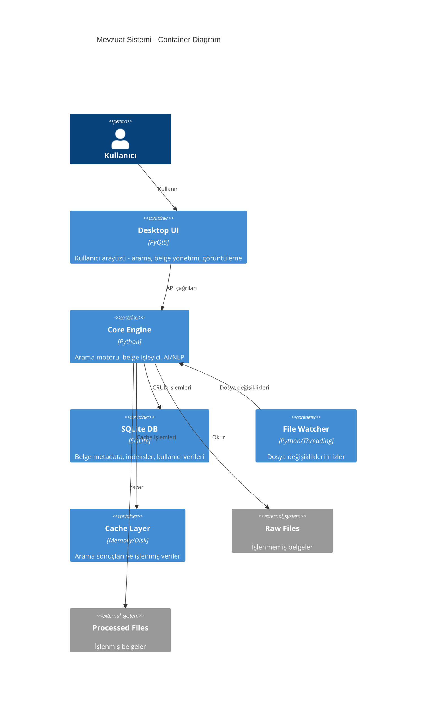
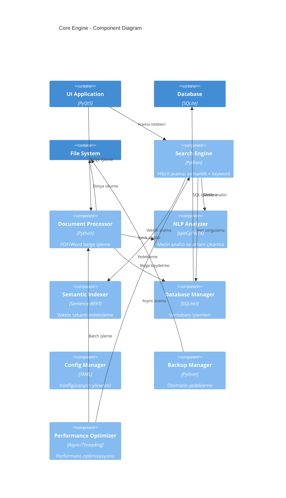

# Mevzuat Sistemi - Mimari Dokümantasyon

## C4 Model - Context, Container, Component, Code

### 1. Context Diagram (Sistem Bağlamı)



### 2. Container Diagram (Konteyner Mimarisi)



### 3. Component Diagram (Bileşen Mimarisi)



### 4. Code Structure (Kod Yapısı)

```text
MevzuatSistemi/
├── app/
│   ├── ui/                          # Kullanıcı Arayüzü (Presentation Layer)
│   │   ├── main_window.py          # Ana pencere (Monolith - Refactor edilecek)
│   │   ├── main_window_refactored.py # SOLID Principles uygulanmış
│   │   ├── search_widget.py        # Arama bileşeni
│   │   ├── result_widget.py        # Sonuç gösterimi
│   │   ├── document_tree_widget.py # Belge ağacı
│   │   ├── document_viewer_widget.py # Belge görüntüleyici
│   │   └── settings_dialog.py      # Ayarlar penceresi
│   │
│   ├── core/                        # İş Mantığı (Business Logic Layer)
│   │   ├── search_engine.py        # Hibrit arama motoru
│   │   ├── document_processor.py   # Belge işleyici
│   │   ├── database_manager.py     # Veritabanı yöneticisi
│   │   ├── performance_optimizer.py # Performans optimizasyonu (YENİ)
│   │   ├── nlp_analyzer.py         # NLP analiz motoru
│   │   └── app_manager.py          # Uygulama koordinatörü
│   │
│   ├── utils/                       # Yardımcı Araçlar (Utility Layer)
│   │   ├── config_manager.py       # Konfigürasyon yönetimi
│   │   ├── logger.py               # Loglama sistemi
│   │   ├── backup_manager.py       # Yedekleme yöneticisi
│   │   ├── pdf_exporter.py         # PDF rapor üretici
│   │   └── file_watcher.py         # Dosya izleyici
│   │
│   └── security/                    # Güvenlik Katmanı
│       ├── __init__.py
│       └── base.py                 # Güvenlik sınıfları
│
├── tests/                          # Test Paketi (YENİ)
│   ├── test_advanced_integration.py # Entegrasyon testleri
│   ├── test_ui_automation.py       # UI otomasyonu
│   ├── test_performance.py         # Performans testleri
│   └── test_runner.py              # Test çalıştırıcı
│
├── docs/                           # Dokümantasyon (YENİ)
│   ├── architecture/               # Mimari dokümantasyon
│   ├── api/                        # API dokümantasyonu
│   └── user_guide/                 # Kullanıcı kılavuzu
│
├── config/                         # Konfigürasyon dosyaları
│   ├── config.yaml
│   └── config_sample.yaml
│
├── requirements.txt                # Python bağımlılıkları
├── pyproject.toml                 # Modern Python proje konfigürasyonu
└── README.md                      # Proje açıklaması
```

## API Dokümantasyonu

### 1. Core Search Engine API

#### SearchEngine Class

```python
class SearchEngine:
    """Hibrit arama motoru - Semantik + Keyword arama"""
    
    async def search(self, query: str, search_type: str = "mixed", 
                    document_types: List[str] = None, 
                    include_repealed: bool = False) -> List[SearchResult]:
        """
        Ana arama metodu
        
        Args:
            query: Arama sorgusu
            search_type: "semantic", "keyword", "mixed"
            document_types: Filtrelenecek belge türleri ["KANUN", "TÜZÜK", ...]
            include_repealed: Mülga maddeleri dahil et
            
        Returns:
            List[SearchResult]: Arama sonuçları listesi
            
        Raises:
            SearchException: Arama hatası durumunda
        """
    
    async def search_with_facets(self, query: str, 
                                facet_filters: Dict[str, Any]) -> FacetedSearchResult:
        """
        Gelişmiş filtrelemeli arama
        
        Args:
            query: Arama sorgusu  
            facet_filters: Çok boyutlu filtreler
            
        Returns:
            FacetedSearchResult: Filtrelenmiş sonuçlar ve facet bilgileri
        """
    
    def rebuild_index(self) -> bool:
        """
        Semantik indeksi yeniden oluştur
        
        Returns:
            bool: İşlem başarı durumu
        """
```

#### SearchResult Data Model

```python
@dataclass
class SearchResult:
    """Arama sonucu veri modeli"""
    id: int
    document_id: int
    document_title: str
    law_number: Optional[str]
    document_type: str
    article_number: Optional[str]
    title: Optional[str]
    content: str
    score: float
    match_type: str  # "exact", "semantic", "keyword", "mixed"
    highlights: List[str] = field(default_factory=list)
    is_repealed: bool = False
    is_amended: bool = False
    metadata: Dict[str, Any] = field(default_factory=dict)
```

### 2. Document Processor API

#### DocumentProcessor Class

```python
class DocumentProcessor:
    """Belge işleme motoru"""
    
    async def process_file(self, file_path: str) -> ProcessingResult:
        """
        Dosyayı işle ve veritabanına ekle
        
        Args:
            file_path: İşlenecek dosya yolu
            
        Returns:
            ProcessingResult: İşlem sonucu
        """
    
    async def process_batch(self, file_paths: List[str], 
                           progress_callback: Optional[Callable] = None) -> BatchResult:
        """
        Çoklu dosya işleme
        
        Args:
            file_paths: İşlenecek dosya listesi
            progress_callback: İlerleme callback fonksiyonu
            
        Returns:
            BatchResult: Toplu işlem sonucu
        """
    
    def extract_text(self, file_path: str) -> str:
        """
        Dosyadan metin çıkart
        
        Args:
            file_path: Dosya yolu
            
        Returns:
            str: Çıkarılan metin
        """
```

### 3. Performance Optimizer API

#### AsyncSearchEngine Class

```python
class AsyncSearchEngine:
    """Asenkron arama motoru wrapper"""
    
    def __init__(self, search_engine: SearchEngine, max_workers: int = 4):
        """
        Args:
            search_engine: Senkron arama motoru
            max_workers: Maksimum worker thread sayısı
        """
    
    async def search_async(self, query: str, **kwargs) -> List[SearchResult]:
        """
        Asenkron arama gerçekleştir
        Cache kullanır ve thread pool'da çalışır
        """
    
    def clear_cache(self) -> None:
        """Arama cache'ini temizle"""
    
    def get_cache_stats(self) -> Dict[str, Any]:
        """Cache istatistiklerini getir"""
```

#### MemoryManager Class

```python
class MemoryManager:
    """Memory yönetimi ve optimizasyon"""
    
    def get_memory_usage(self) -> float:
        """Mevcut memory kullanımını MB cinsinden döndür"""
    
    def should_trigger_gc(self) -> bool:
        """Garbage collection gerekli mi kontrol et"""
    
    def force_gc(self) -> Dict[str, Any]:
        """Garbage collection zorla ve sonuçları döndür"""
    
    def optimize_memory_usage(self) -> None:
        """Memory kullanımını optimize et"""
```

### 4. UI Component API (SOLID Refactored)

#### IMainWindowView Interface

```python
class IMainWindowView(ABC):
    """Ana pencere görünüm interface'i"""
    
    @abstractmethod
    def show_message(self, message: str, duration: int = 0) -> None:
        """Durum çubuğunda mesaj göster"""
    
    @abstractmethod
    def show_progress(self, visible: bool, value: int = 0, maximum: int = 100) -> None:
        """Progress bar göster/gizle"""
    
    @abstractmethod
    def update_result_count(self, count: int) -> None:
        """Sonuç sayısını güncelle"""
```

#### MainWindowController Class

```python
class MainWindowController:
    """MainWindow kontrolcü sınıfı - SOLID Principles"""
    
    def __init__(self, config, db, search_engine, document_processor, file_watcher):
        """Dependency injection ile bağımlılıkları al"""
    
    async def perform_search(self, query: str, search_type: str, filters: Dict[str, Any]) -> None:
        """Arama işlemini yönet"""
    
    async def add_documents_async(self, file_paths: List[str], 
                                 progress_callback: Optional[Callable] = None) -> Dict[str, Any]:
        """Belgeleri asenkron olarak ekle"""
```

## Performans Metrikleri

### Hedef Performans Değerleri

```yaml
performance_targets:
  search:
    simple_query: "<100ms"      # Basit arama
    complex_query: "<500ms"     # Karmaşık arama  
    faceted_search: "<1000ms"   # Gelişmiş filtreleme
  
  document_processing:
    single_pdf: "<2s"           # PDF işleme
    batch_100_files: "<120s"    # 100 dosya toplu işleme
    
  memory:
    idle_usage: "<150MB"        # Boştayken memory
    active_usage: "<500MB"      # Aktif kullanımda
    max_usage: "<1GB"          # Maksimum limit
  
  startup:
    cold_start: "<5s"          # İlk açılış
    warm_start: "<2s"          # Sonraki açılışlar
```

### Monitoring ve Alerting

```python
# Performance monitoring decorator örneği
@monitor_performance
async def search_with_monitoring(self, query: str) -> List[SearchResult]:
    """Performans izlemeli arama"""
    with performance_tracker.measure("search_operation"):
        results = await self.search_async(query)
        
        # Alert conditions
        if performance_tracker.last_operation_time > 1000:  # 1 saniye
            logger.warning(f"Slow search detected: {query}")
        
        return results
```

## Güvenlik Mimarisi

### 1. Input Validation

```python
class SecureInputValidator:
    """Güvenli input validasyonu"""
    
    def validate_search_query(self, query: str) -> str:
        """SQL injection ve XSS koruması"""
    
    def validate_file_path(self, file_path: str) -> str:
        """Path traversal koruması"""
    
    def sanitize_output(self, content: str) -> str:
        """Output sanitization"""
```

### 2. Error Handling

```python
class SecureErrorHandler:
    """Güvenli hata yönetimi"""
    
    def handle_database_error(self, error: Exception) -> None:
        """Veritabanı hatalarını güvenli şekilde yönet"""
    
    def handle_file_error(self, error: Exception, file_path: str) -> None:
        """Dosya hatalarını yönet"""
```

## Testing Strategy

### Test Piramidi

```text
    /\
   /  \    E2E Tests (Az sayıda, yavaş)
  /____\   
 /      \   Integration Tests (Orta, orta hız)
/__________\ Unit Tests (Çok, hızlı)
```

### Test Türleri ve Coverage

1. **Unit Tests** (>90% coverage)
   - Core business logic
   - Utility functions
   - Data models

2. **Integration Tests** (>80% coverage)
   - Database operations
   - File operations  
   - API integrations

3. **UI Tests** (>60% coverage)
   - User workflows
   - Component interactions
   - Theme switching

4. **Performance Tests**
   - Load testing
   - Memory leak testing
   - Concurrency testing

5. **Security Tests**
   - Input validation
   - SQL injection attempts
   - File system access

## Deployment Architecture

### Desktop Application Deployment

```yaml
deployment:
  target: "Windows Desktop"
  packaging: "PyInstaller"
  installer: "NSIS/WiX"
  
  build_pipeline:
    - code_quality_check
    - unit_tests
    - integration_tests
    - security_scan
    - build_executable
    - create_installer
    - sign_binary
    - test_installation
    
  distribution:
    - internal_testing
    - user_acceptance_testing  
    - production_release
```

### Configuration Management

```yaml
environments:
  development:
    database: "sqlite://dev.db"
    log_level: "DEBUG"
    performance_monitoring: true
    
  testing:
    database: "sqlite://test.db"
    log_level: "INFO"
    performance_monitoring: true
    
  production:
    database: "sqlite://prod.db"
    log_level: "WARNING"
    performance_monitoring: false
```

Bu mimari dokümantasyon, sistemin hem mevcut durumunu hem de SOLID principles ve performance optimization ile geliştirilmiş halini kapsamaktadır.
